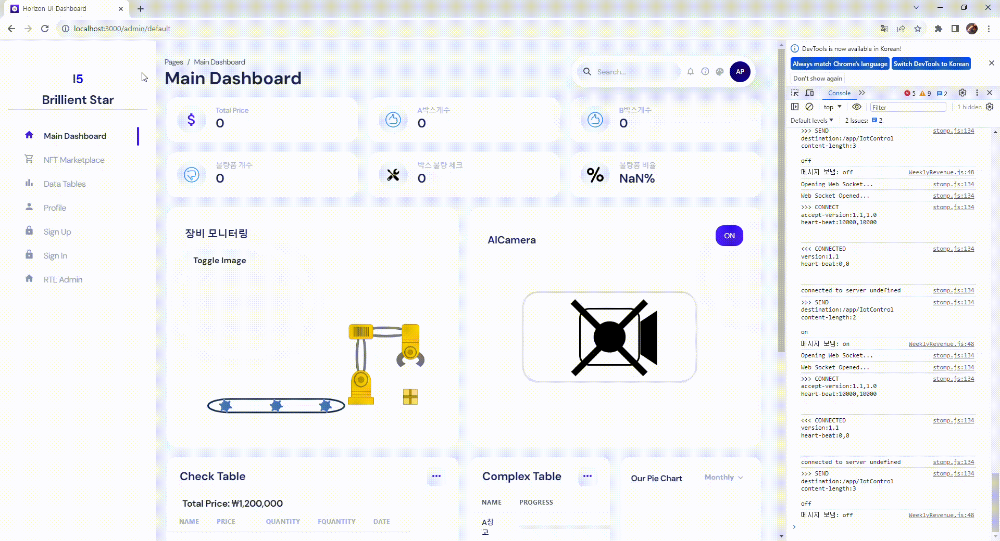
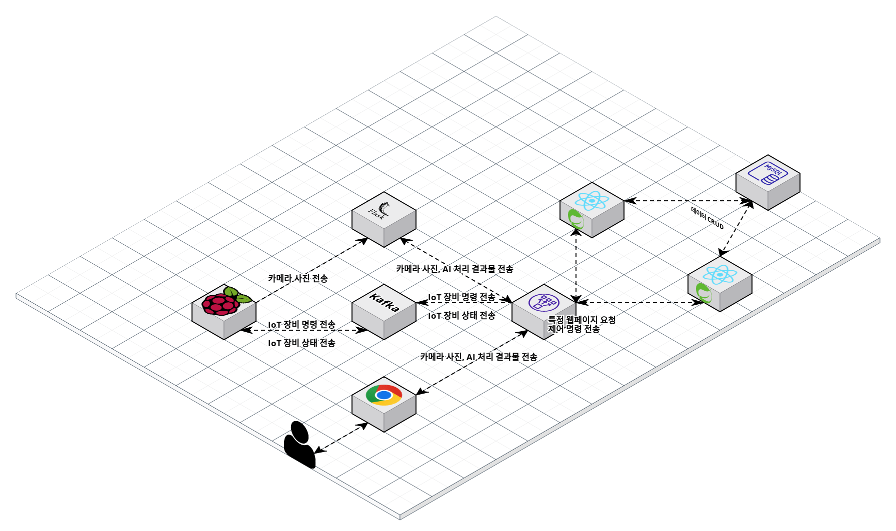

<h1 align="center">스마트 물류 자동화 시스템 👍</h1>


<center>
    
</center>


> [한국품질재단] 프로젝트 기반 ICT 융합 스마트팩토리 전문가 양성과정 / 1팀


 
<!-- 🎤[발표](https://www.youtube.com/watch?v=dhMrKTwNI8U&lc=UgzCJR3WxkvsckRyyO94AaABAg&ab_channel=%EB%94%B0%EB%9D%BC%ED%95%98%EB%A9%B4%EC%84%9C%EB%B0%B0%EC%9A%B0%EB%8A%94IT)  
📃[프로젝트 회고록](블로그주소) -->

<br>

## ✨ 프로젝트 설명

```sh
AI가 탑재된 카메라로 QR코드를 인식하여 물류하는 시스템을 구현
```

<!-- ## 🎬 [데모 사이트](http://www.naver.com) <- 클릭하면 이동됩니다!
```sh
현재는 AWS 프론트엔드, 백엔드, RDS로 배포한 상태입니다.
`````` -->


## 📌 기술 선정 이유

```sh
1. React:
사용자 인터페이스(UI) 개발을 위해 선택.
모듈화된 UI 구축과 빠른 성능을 제공.

2. Spring Boot:
서버 측 애플리케이션을 개발하기 위해 선택.
빠른 개발과 배포를 지원하는 Spring 기반 프레임워크.

3. Raspberry Pi 4 (Python):
저렴하면서 강력한 컴퓨팅 능력을 활용하기 위해 선택.
Python을 사용하여 IoT 및 임베디드 프로젝트 구현.

4. AI (YOLOv5):
객체 검출을 위해 선택.
빠른 실시간 객체 검출을 제공하는 경량화된 AI 모델.
```


## 📌 프로젝트 목표

```sh
AI카메라가 QR코드를 인식하여 로봇팔이 명령을 받고 물류를 다른 벨트로 옮기기
```


## 🔍 Overview

### 1. QR 코드로 물류 인식 후 로봇팔 기동

🎬[클릭해서 유튜브로 이동](https://www.youtube.com/watch?v=YpPmn7hPwsQ) 


```sh
yolo5 AI가 탑재된 RasberryPi 카메라 모듈로 
상품의 QR코드를 인식한 후 
로봇팔이 기동하여 물류상자를 다른 벨트로 옮긴다.
``````

<br>

### 2. 프론트엔드에서 카메라 제어

<center>
    
</center>
어떤 어떤 어떤 걸 작성하는 게시판 기능

<br>

### 3. 프론트엔드에서 DB에 저장된 상품목록 수정 및 삭제 가능

<center>
    
</center>
어떤 어떤 어떤 걸 작성하는 게시판 기능

<br>


## System Architecture

<center>
    
    
</center>

대용량 트래픽을 고려한 서버 이중화

<br>


## 🔧 각 프로젝트 상세 설명

### [프론트 엔드 github](https://github.com/LUKR7Q/frontI5) <- 클릭하면 이동됩니다!

### [백 엔드 github](https://github.com/LUKR7Q/backI5) <- 클릭하면 이동됩니다!

### [인공지능 github](https://github.com/LUKR7Q/AIserverI5) <- 클릭하면 이동됩니다!

### [IoT github](https://github.com/LUKR7Q/IoTI5) <- 클릭하면 이동됩니다!


## 🤼‍♂️팀원

Team Leader : 🐯**김용범**

Backend : 🐶 **유창훈**

Frontend : 🐱 **김용범, 박지훈**

인공지능 : 🦁 **유창훈**

IoT : 🐺 **박이건**